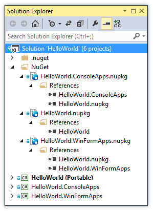

# Welcome to NuProj!

[](https://gitter.im/nuproj/nuproj?utm_source=badge&utm_medium=badge&utm_campaign=pr-badge&utm_content=badge)

[![dev version][build-status-img]][build-status-url] [![Issue Stats][pull-requests-img]][pull-requests-url] [![Issue Stats][issues-closed-img]][issues-closed-url]

[build-status-img]: http://img.shields.io/appveyor/ci/terrajobst/nuproj.svg?style=flat
[build-status-url]: https://ci.appveyor.com/project/terrajobst/nuproj

[pull-requests-img]: http://www.issuestats.com/github/nuproj/nuproj/badge/pr
[pull-requests-url]: http://www.issuestats.com/github/nuproj/nuproj

[issues-closed-img]: http://www.issuestats.com/github/nuproj/nuproj/badge/issue
[issues-closed-url]: http://www.issuestats.com/github/nuproj/nuproj

NuProj provides MSBuild based support for creating NuGet packages (.nupkg).

Creating NuGet packages is as simple as:

    NuGet.exe pack MyPackages.nuspec -basepath D:\source\bin

Well, except for the part where you need to integrate this into your build
process.

NuProj allows defining the entire .nuspec file via a regular MSBuild project:

    msbuild MyPackage.nuproj /p:BasePath=D:\source\bin

At first this might not look like a big deal but this gives you the following
advantages:

* Easy integration into existing build processes
* No placeholder limitations -- every piece of information can be injected via
  the build process
* Proper reporting of errors and warnings
* Enables a [Visual Studio Integration][NuProjVS]

Below is an example how HelloWorld.nuproj would look like:

```xml
<?xml version="1.0" encoding="utf-8"?>
<Project ToolsVersion="4.0"
         DefaultTargets="Build"
         xmlns="http://schemas.microsoft.com/developer/msbuild/2003">
  <PropertyGroup>
    <Id>HelloWorld</Id>
    <Version>1.0.0</Version>
    <Title>HelloWorld</Title>
    <Authors>Me</Authors>
    <Owners>Me</Owners>
    <Description>Hello World</Description>
    <ReleaseNotes>Hello World</ReleaseNotes>
    <Summary>Hello World</Summary>
    <ProjectUrl>http://nuproj.codeplex.com</ProjectUrl>
    <LicenseUrl>http://nuproj.codeplex.com/license</LicenseUrl>
    <Copyright>Copyright (c) Immo Landwerth</Copyright>
    <RequireLicenseAcceptance>False</RequireLicenseAcceptance>
    <Tags>HelloWorld</Tags>
  </PropertyGroup>
  <ItemGroup>
    <Library Include="$(BasePath)HelloWorld.dll">
      <TargetFramework>net40</TargetFramework>
    </Library>
  </ItemGroup>
  <PropertyGroup>
    <NuProjTargetsPath Condition=" '$(NuProjTargetsPath)' == '' ">$(MSBuildExtensionsPath)\NuProj\NuProj.targets</NuProjTargetsPath>
  </PropertyGroup>
  <Import Project="$(NuProjTargetsPath)" />
</Project>
```

## Visual Studio Integration

Also, make sure to check out the [Visual Studio Integration][NuProjVS]:



## Documentation

For more details, check out the [documentation](docs/Documentation.md).

[NuProjVS]: http://visualstudiogallery.msdn.microsoft.com/fbe9b9b8-34ae-47b5-a751-cb71a16f7e96
